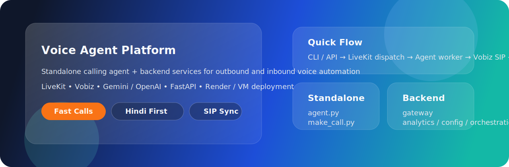
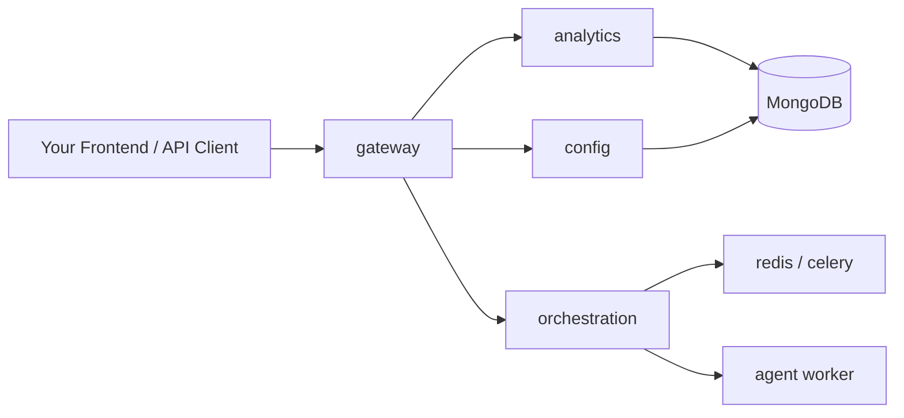

# 🚀 Voice Agent Platform

<p align="center">
  
</p>

<p align="center">
  
  
  
  
</p>

<p align="center">
  <b>Single source of truth for this repo.</b><br/>
  This README replaces the scattered markdown docs and covers setup, calling, backend services, deployment, troubleshooting, and contribution notes in one place.
</p>

## ✨ What This Repo Does

This repository contains two usable modes:

1. **Standalone calling flow**
   Use the root scripts for the fastest path to outbound and inbound voice calls.

2. **Backend service stack**
   Use the `backend/` microservices if you want APIs, campaigns, analytics, auth, and admin-style orchestration.

Core capabilities:

- 📞 Outbound calling through **LiveKit SIP + Vobiz**
- ☎️ Inbound call handling through **LiveKit dispatch**
- 🧠 Voice AI using **Gemini Live** or **OpenAI**
- 🌐 Hindi-first, English-first, or Hinglish conversations
- 🔁 SIP trunk sync from `.env`
- 🛠️ Transfer support, analytics hooks, and optional campaign orchestration

## 🗂️ Repo Layout

| Path | Purpose |
| --- | --- |
| `agent.py` | Standalone outbound worker |
| `agent_inbound.py` | Standalone inbound worker |
| `make_call.py` | CLI dispatcher for outbound calls |
| `setup_trunk.py` | Sync the LiveKit outbound trunk from `.env` |
| `setup_inbound.py` | Create the inbound LiveKit trunk + dispatch rule |
| `backend/` | Multi-service backend platform |
| `scripts/` | API automation and test helpers |
| `assets/readme-banner.svg` | README hero banner |

## 🧭 Architecture

### Standalone Flow


### Backend Service Flow



## ⚡ Quick Start: Standalone Agent

### 1. Install

```powershell
python -m venv .venv
.venv\Scripts\Activate.ps1
pip install -r requirements.txt
```

### 2. Create `.env`

```powershell
Copy-Item .env.example .env
```

Minimum values you need:

```env
LIVEKIT_URL=wss://your-project.livekit.cloud
LIVEKIT_API_KEY=your_livekit_api_key
LIVEKIT_API_SECRET=your_livekit_api_secret

VOBIZ_SIP_DOMAIN=your-outbound-trunk.sip.vobiz.ai
VOBIZ_AUTH_ID=your_vobiz_auth_id
VOBIZ_AUTH_TOKEN=your_vobiz_auth_token
VOBIZ_CALLER_ID=+91XXXXXXXXXX

REALTIME_PROVIDER=google
GOOGLE_API_KEY=your_google_api_key
GOOGLE_REALTIME_MODEL=gemini-2.5-flash-native-audio-preview-12-2025
GOOGLE_REALTIME_VOICE=Kore

AGENT_DEFAULT_LANGUAGE=hi
DEFAULT_OUTBOUND_TARGET=+91XXXXXXXXXX
```

If you prefer OpenAI realtime instead:

```env
REALTIME_PROVIDER=openai
OPENAI_API_KEY=sk-...
OPENAI_REALTIME_MODEL=gpt-realtime-mini
OPENAI_REALTIME_VOICE=marin
```

### 3. Sync the outbound SIP trunk

```powershell
python setup_trunk.py
```

This updates the LiveKit outbound trunk using the current `.env` values for:

- `VOBIZ_SIP_DOMAIN`
- `VOBIZ_AUTH_ID` / `VOBIZ_USERNAME`
- `VOBIZ_AUTH_TOKEN` / `VOBIZ_PASSWORD`
- `VOBIZ_CALLER_ID` / `VOBIZ_OUTBOUND_NUMBER`

### 4. Start the worker

```powershell
python agent.py start
```

For local debugging with file watching:

```powershell
python agent.py dev
```

### 5. Place a call

```powershell
python make_call.py +919876543210
```

Multiple targets:

```powershell
python make_call.py --to +919876543210,+14155550123
```

Interactive mode:

```powershell
python make_call.py
```

## ☎️ Inbound Setup

1. Set the inbound number in `.env`

```env
VOBIZ_INBOUND_NUMBER=+91XXXXXXXXXX
```

2. Create inbound trunk + dispatch rule:

```powershell
python setup_inbound.py
```

3. Start the inbound worker:

```powershell
python agent_inbound.py start
```

4. In Vobiz, point the inbound trunk to the LiveKit SIP URI and link the number.

## 🧠 Voice Modes

### Gemini Live

Current recommended Gemini setup:

```env
REALTIME_PROVIDER=google
GOOGLE_REALTIME_MODEL=gemini-2.5-flash-native-audio-preview-12-2025
GOOGLE_REALTIME_VOICE=Kore
VOICE_STYLE_HINT=Speak in a bright, slightly higher-pitched feminine tone while staying natural and clear on phone audio.
```

Notes:

- `Kore` is supported in the current Gemini path
- there is no direct pitch knob exposed in this code path
- higher / brighter tone is steered via `VOICE_STYLE_HINT`

### OpenAI Realtime

```env
REALTIME_PROVIDER=openai
OPENAI_REALTIME_MODEL=gpt-realtime-mini
OPENAI_REALTIME_VOICE=marin
```

## 🧩 Important Environment Variables

### Telephony

| Variable | What it does |
| --- | --- |
| `LIVEKIT_URL` | LiveKit websocket endpoint |
| `LIVEKIT_API_KEY` | LiveKit API key |
| `LIVEKIT_API_SECRET` | LiveKit API secret |
| `OUTBOUND_TRUNK_ID` | LiveKit outbound trunk ID (`ST_...`) |
| `VOBIZ_SIP_DOMAIN` | Vobiz outbound SIP domain |
| `VOBIZ_AUTH_ID` / `VOBIZ_USERNAME` | Vobiz SIP username |
| `VOBIZ_AUTH_TOKEN` / `VOBIZ_PASSWORD` | Vobiz SIP password |
| `VOBIZ_CALLER_ID` / `VOBIZ_OUTBOUND_NUMBER` | Caller ID used on outbound calls |
| `VOBIZ_TRUNK_NAME` | Friendly trunk name used for lookup and sync |

### Agent behavior

| Variable | What it does |
| --- | --- |
| `AGENT_PERSONA_NAME` | Spoken name of the agent |
| `AGENT_COMPANY_NAME` | Spoken company name |
| `AGENT_DEFAULT_LANGUAGE` | `hi` or `en` |
| `OUTBOUND_FIRST_MESSAGE` | First spoken message after answer |
| `DEFAULT_OUTBOUND_TARGET` | Fallback target for CLI calls |
| `DEFAULT_TRANSFER_NUMBER` | Transfer destination |
| `VOICE_STYLE_HINT` | Style prompt for Gemini voice delivery |

### Provider selection

| Variable | Values |
| --- | --- |
| `REALTIME_PROVIDER` | `google` or `openai` |
| `OPENAI_REALTIME_AUDIO` | `true` / `false` |
| `GOOGLE_REALTIME_MODEL` | Gemini Live model |
| `GOOGLE_REALTIME_VOICE` | Gemini voice name |
| `OPENAI_REALTIME_MODEL` | OpenAI realtime model |
| `OPENAI_REALTIME_VOICE` | OpenAI realtime voice |

## 🏗️ Backend Services

The `backend/` directory is the larger production-style service stack.

Main services:

- `gateway` → public API entry point
- `config` → assistants, SIP configs, tools
- `analytics` → call records, analysis, webhooks
- `orchestration` → campaigns, job queue
- `agent` → worker for backend-managed calls
- `redis` / celery worker → queue + async jobs

Run the backend stack with Docker Compose if you need the API layer:

```powershell
docker compose up -d
```

## 🌍 Deployment Notes

### Fastest practical setup

- **Frontend**: your own app on Vercel
- **Backend**: this repo on a VM or multi-service platform
- **Database**: MongoDB Atlas
- **Queue/cache**: Redis

### Render

If you deploy the backend stack on Render, you typically need:

- `gateway` as a public web service
- `config`, `analytics`, `orchestration` as private services
- `agent` and `celery-worker` as background workers
- Redis + MongoDB

### Simplest backend hosting

For this repo, one Linux VM running Docker Compose is usually simpler than splitting the microservices across a free-tier PaaS.

## 🔁 Call Transfer

The standalone outbound agent supports SIP REFER transfer.

Typical phrases:

- `transfer me`
- `transfer me to a live agent`
- `transfer me to +91...`

Relevant env:

```env
TRANSFER_REQUIRE_CONFIRMATION=true
DEFAULT_TRANSFER_NUMBER=+91XXXXXXXXXX
```

## 🛠️ Automation Scripts

`scripts/full_api_automation.py` is still available, but it now requires explicit env values instead of baked-in SIP secrets:

```powershell
$env:AUTOMATION_SIP_DOMAIN='your-sip-domain.sip.vobiz.ai'
$env:AUTOMATION_SIP_USERNAME='your_sip_username'
$env:AUTOMATION_SIP_PASSWORD='your_sip_password'
$env:AUTOMATION_FROM_NUMBER='+91xxxxxxxxxx'
python scripts/full_api_automation.py
```

## 🧪 Useful Commands

```powershell
python setup_trunk.py
python agent.py start
python make_call.py +919876543210
python setup_inbound.py
python agent_inbound.py start
docker compose up -d
```

## 🚨 Troubleshooting

| Problem | Meaning | Fix |
| --- | --- | --- |
| SIP `500` | Provider got the INVITE but failed internally | Verify Vobiz trunk domain, auth, KYC, balance, caller ID, routing |
| `486 Busy Here` | The callee is busy | Retry later |
| Worker cannot bind to `8081` | Another agent process is already running | Stop the old worker before starting a new one |
| Call connects but agent says nothing | Wrong provider key or worker issue | Verify provider key and restart the worker |
| Gemini warns `tool_choice is not supported` | Non-blocking Google realtime limitation | Safe to ignore unless you need tool-calling behavior |
| Some numbers cannot be called | Trial / provider routing restrictions | Check Vobiz account status and destination permissions |

### Vobiz-specific blockers to watch for

- incomplete KYC
- trial account restrictions
- trial number cannot be linked
- missing outbound trunk credentials
- outbound route not enabled
- caller ID not approved on that trunk

## 📈 What “Healthy” Logs Look Like

Good signs in logs:

- `registered worker`
- `Synced existing outbound trunk from env: ST_...`
- `Call answered! Agent is now listening.`
- `user_input_transcribed final=True ...`
- `conversation_item_added role=assistant ...`

These together mean:

- LiveKit is connected
- the SIP leg connected
- the caller answered
- speech was transcribed
- the model responded

## 🤝 Contributing

If you contribute:

- keep changes focused
- avoid committing `.env`
- update `.env.example` when you add env vars
- run local checks before committing

Useful local verification:

```powershell
python -B -m py_compile agent.py setup_trunk.py
python scripts/test_api_key_auth.py
```

## 📦 Cleanup Notes

This repo intentionally uses **one README as the documentation source** now.

The old markdown docs were removed to keep the project simpler and easier to navigate. The Docusaurus app is retained only as a lightweight site shell and no longer depends on markdown content.
